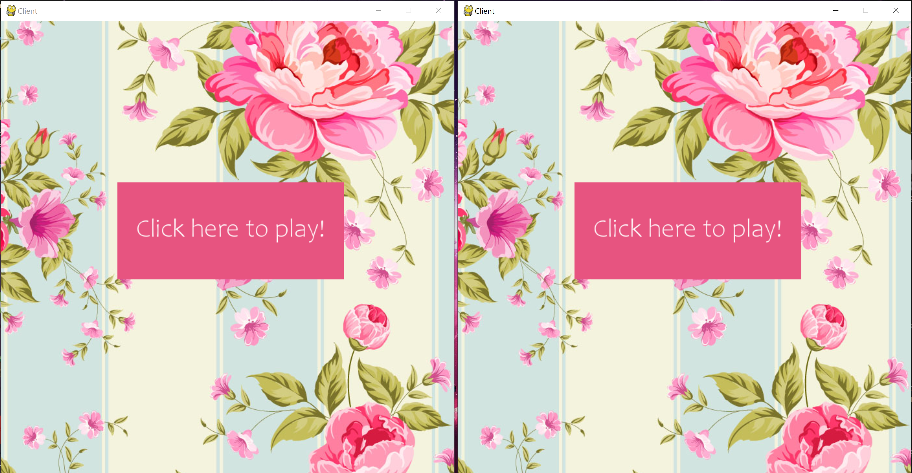

# Multiplayer Rock-Paper-Scissors-Game
Rock Paper Scissors Game in Python (v3.7.3)

This game was created in Python v3.7.3 in PyCharm IDE. It is a multiplayer game realized with threads and pygame, which can be played by even number of players at the same time. 

## To install requirements run: 
pip install -r requirements.txt

## How to use? 
First run server.py file, than you can run multiple client.py files. 

First client window is easy menu: 

